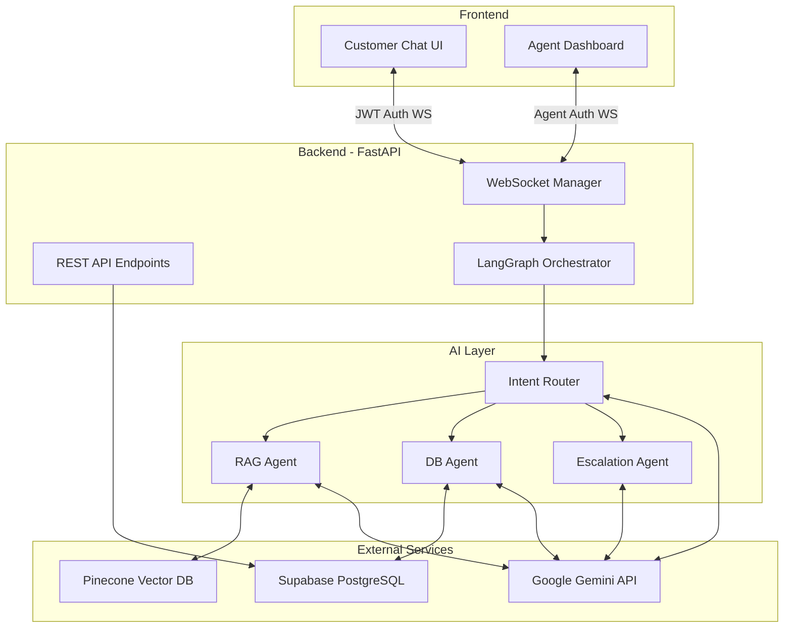

# IntelliSupport - AI Customer Support Agent

**IntelliSupport** is an intelligent, full-stack Customer Support Agent designed to autonomously handle customer inquiries, process complex transactions, and intelligently hand off conversations to human agents when needed. 

This project demonstrates a production-minded architecture integrating **LangGraph**, **Pinecone RAG**, **Supabase**, and **FastAPI WebSockets** to create a seamless customer service experience.

---

## 🎯 Problem Statement
Modern customer support is often fragmented, with basic chatbots failing to understand context, hallucinating answers, or improperly executing destructive actions (like cancellations). Furthermore, the transition from AI to human agents is often clunky and loses conversation context.

## 🚀 Project Objective
Build a robust, secure, and stateful AI Customer Support Agent capable of:
1. Grounded policy question answering using Pinecone RAG.
2. Secure tool execution for high-risk actions (e.g., cancelling an order requires explicit user confirmation).
3. Seamless real-time AI-to-Human handover via WebSockets.
4. Comprehensive identity management and resource ownership validation to ensure a customer can only access their own data.

## ✨ Key Features
- **Intelligent Routing:** Uses LangGraph to classify intent and route inquiries to specialized sub-agents (RAG, DB, Web, Escalation).
- **RAG for Grounded Answers:** Answers policy queries purely from an embedded knowledge base using Pinecone, with explicit source citations.
- **High-Risk Action Gating:** Actions like `cancel_order` and `process_refund` enter a "pending approval" state, requiring explicit customer confirmation ("yes") before execution.
- **Secure Authentication:** Implements JWT-based authentication for customers and static agent-tokens for support staff.
- **Strict Ownership Validation:** The AI layer operates entirely within the boundaries of the authenticated `customer_id`. The LLM cannot override or fabricate user identities to access unauthorized data.
- **AI to Human Handover:** Angry customers or complex queries seamlessly escalate to a human support agent dashboard in real-time without losing chat history.

---

## 🛠️ Technology Stack
- **Backend:** Python, FastAPI, WebSockets
- **AI Orchestration:** LangChain, LangGraph, Google Gemini (via `google-genai`)
- **Vector DB (RAG):** Pinecone
- **Relational DB:** Supabase (PostgreSQL)
- **Frontend:** Next.js, React, Tailwind CSS

---

## 🏗️ Architecture Overview



### How LangGraph is used
LangGraph models the AI conversation as a state machine. It begins with an **Intent Router** which dynamically selects the next node (RAG, Database Tools, Web Search, or Human Escalation). This enables multi-turn planning, conditional logic, and robust recovery if a tool fails.

### How RAG/Pinecone is used
Documents in the `backend/knowledge_base` are chunked and embedded into Pinecone. When the Intent Router detects a policy question, the RAG Agent queries Pinecone to fetch the top matching document chunks and uses them as strict `CONTEXT`. The LLM is explicitly instructed to cite the source file (e.g., `return_policy.md`) and is restricted from utilizing external knowledge.

### How Supabase is used
Supabase acts as the primary datastore for customers, orders, products, tickets, and conversation histories. It also provides Row Level Security (RLS) to ensure that backend API keys are required for access, locking down the public API.

### WebSockets & Human Handover
The `WebSocketManager` maintains live connections for both customers and agents. 
- When an AI determines an escalation is necessary (or if the user explicitly requests a human), the session's `mode` is flipped to `human`.
- The AI execution is paused, and messages are directly routed between the customer and the human agent.
- Once resolved, the agent releases the session, and LangGraph resumes control.

### Authentication & Security Model
- **Customers** receive a JWT token upon login which dictates their identity.
- **Resource Ownership:** The authenticated `customer_id` is securely injected into all DB tools by the backend execution layer (`graph.py`). The LLM cannot spoof a different `customer_id`.
- **Agent Dashboard:** Protected by a static `AGENT_SECRET` for demonstration purposes.

---

## 🚀 Running the Project Locally

### 1. Environment Setup
Create a `.env` file in the `backend/` directory by copying the example template:
```bash
cd backend
cp .env.example .env
```
Fill in the necessary keys for Supabase, Pinecone, and Gemini API.

### 2. Backend Startup
Requires Python 3.10+
```bash
cd backend
python -m venv .venv
source .venv/bin/activate  # Or .venv\Scripts\activate on Windows
pip install -r requirements.txt

# Run the FastAPI server
python -m uvicorn app.main:app --host 0.0.0.0 --port 8000
```

### 3. Frontend Startup
Requires Node.js 18+
```bash
cd frontend
npm install
npm run dev
```
Access the application:
- Customer UI: `http://localhost:3000`
- Agent Dashboard: `http://localhost:3000/agent`

### 4. Running Tests
```bash
cd backend
# Run all tests
python -m pytest tests/ -v
```

## 🔮 Future Improvements
While the current architecture is robust for a major project submission, future iterations would benefit from:
- A production-grade Identity Provider (OAuth2/OIDC) instead of custom JWT handling.
- A distributed WebSocket layer using Redis Pub/Sub to support horizontal scaling across multiple FastAPI instances.
- A background task queue (like Celery) for non-blocking asynchronous email delivery in production scenarios.
